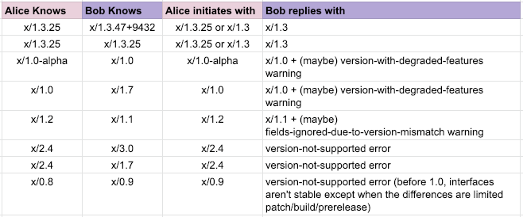

# Semver Rules for Protocols

[Semver](https://semver.org) rules apply in cascading fashion to versions
of protocols and individual message types. The version of a message type
or protocol is expressed in the `semver` portion of its [identifying URI](
uris.md).

Individual message types are versioned as part of a coherent protocol, which
constitutes a [public API in the semver sense](https://semver.org/#spec-item-1).
An individual message type can add new optional fields, or deprecate
existing fields, [with only a change to its protocol's minor
version](https://semver.org/#spec-item-7).
Similarly, a protocol can add new message types (or [adopted
ones](template.md#adopted-messages)) with only a change
to the minor version. It can announce deprecated fields. It can add additional
semantics around optional decorators. These are all backwards-compatible
changes, also requiring only a minor version update.

Changes that remove fields or message types, that make formerly optional
things required, or that alter the state machine in incompatible
ways, must result in an [increase of the major version of the protocol/primary
message family](https://semver.org/#spec-item-8).

Because protocol handling choices depend mainly on major and minor version
numbers, protocol versions are often simplified to major.minor. However,
more complex versions do have defined behavior, and should be handled
correctly by agents.

### Version Negotiation

The semver portion of a [message type or protocol identifier URI](uris.md) is
used to establish the version of a protocol that parties use during an
interaction.

#### Initiator

Unless Alice's agent (the initiator of a protocol) knows from prior history
that it should do something different, it should begin a protocol using the
highest version number that it supports. For example, if A.1
supports versions 2.0 through 2.2 of protocol X, it should use 2.2 as the
version in the message type of its first message.

#### Recipient Rules

Agents for Bob (the recipient) should reject messages from protocols with major
versions different from those they support. For major version 0, they should also
reject protocols with minor versions they don't support, since semver stipulates
that [features are not stable before 1.0](https://semver.org/#spec-item-4). For
example, if B.1 supports only versions 2.0 and 2.1 of protocol X, it should reject
any messages from version 3 or version 1 or 0. In most cases, rejecting a message
means sending a `problem-report` that the message is unsupported. The `code` field
in such messages should be `version-not-supported`. Agents that receive such a
`problem-report` can then use the [Protocol Discovery Protocol](
https://github.com/hyperledger/indy-hipe/pull/73)
to resolve version problems.

Recipient agents should accept messages that differ from their own supported version
of a protocol only in the patch, prerelease, and/or build fields, whether these
differences make the message earlier or later than the version the recipient prefers.
These messages will be robustly compatible.

For major version >= 1, recipients should also accept messages that differ only in that
the message's minor version is earlier than their own preference. In such a case, the
recipient should degrade gracefully to use the earlier version of the protocol. If the
earlier version lacks important features, the recipient may optionally choose to send,
in addition to a response, a `problem-report` with code `version-with-degraded-features`.

If a recipient supports protocol X version 1.0, it should tentatively
accept messages with later minor versions (e.g., 1.2). Message types that
differ in only in minor version are guaranteed to be compatible *for the
feature set of the earlier version*. That is, a 1.0-capable agent can support
1.0 features using a 1.2 message, though of course it will lose any features
that 1.2 added. Thus, accepting such a message could have two possible outcomes:

1. The message at version 1.2 might look and behave exactly like it did at version
1.0, in which case the message will process without any trouble.

2. The message might contain some fields that are unrecognized and need to be ignored.

In case 2, it is best practice for the recipient to send a `problem-report` that
is a *warning*, not an *error*, announcing that some fields could not be processed
(code = `fields-ignored-due-to-version-mismatch`). Such a message is *in addition
to* any response that the protocol demands of the recipient.

If the recipient of a protocol's initial message generates a response, the response
should use the latest major.minor protocol version that both parties support and
know about. Generally, all messages after the first use only major.minor

 
