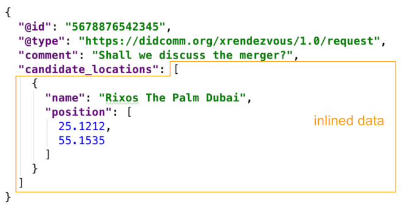
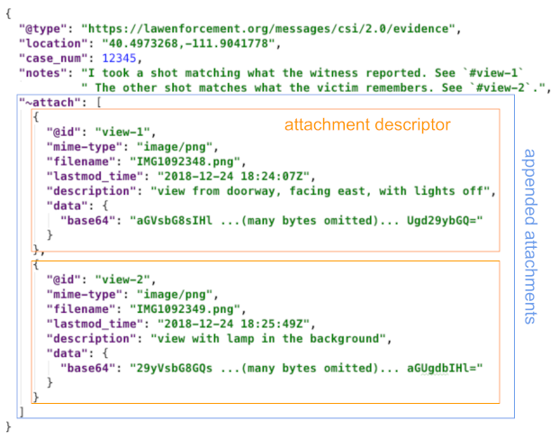
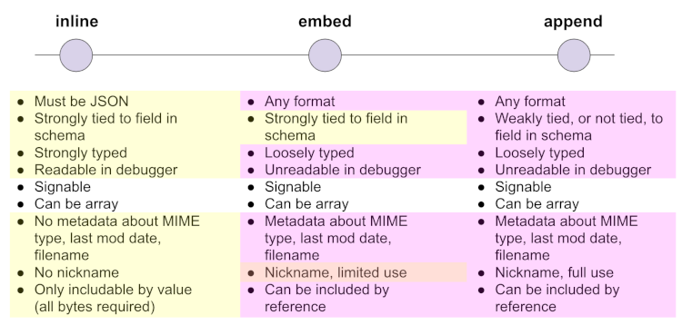
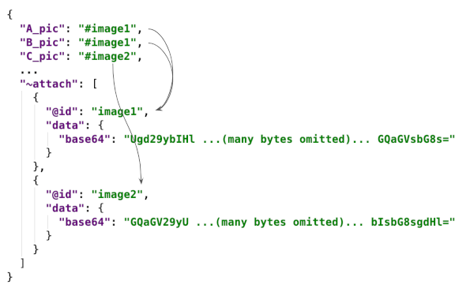
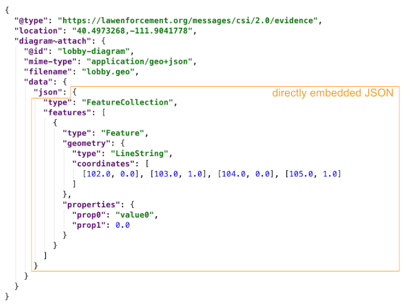
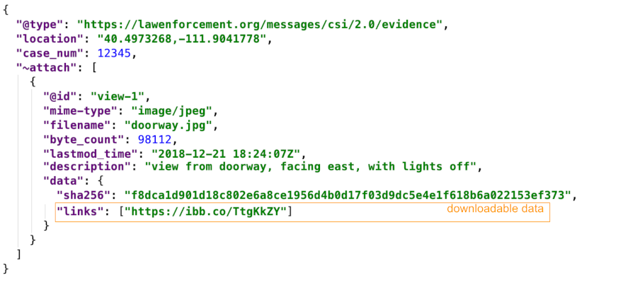

# Aries RFC 0017: Attachments

- Authors: [Daniel Hardman](daniel.hardman@gmail.com), Sam Curren, Andrew Whitehead
- Status: [ACCEPTED](/README.md#accepted)
- Since: 2019-01-31
- Status Note: Used in a number of other RFCs.
- Start Date: 2018-12-24
- Tags: [concept](/tags.md#concept)

## Summary

Explains the three canonical ways to attach data to
an agent message.

## Motivation

[DIDComm](../0005-didcomm/README.md) messages
use a structured format with a defined schema and a
small inventory of scalar data types (string, number, date, etc).
However, it will be quite common for messages to supplement formalized
exchange with arbitrary data--images, documents, or types of
media not yet invented.

We need a way to "attach" such content to DIDComm messages. This method
must be flexible, powerful, and usable without requiring new schema
updates for every dynamic variation.

## Tutorial

### Messages versus Data

Before explaining how to associate data with a message, it is worth
pondering exactly how these two categories of information differ.
It is common for newcomers to DIDComm to argue that messages are just
data, and vice versa. After all, any data can be transmitted over
DIDComm; doesn't that turn it into a message? And any message can
be saved; doesn't that make it data?

While it is true that messages and data are highly related,
some semantic differences matter:

* __Messages are primarily about communication__. Their meaning is tied
to a communication context. [Messages are a mechanism whereby
state evolves in a protocol](../0003-protocols/README.md#ingredients).
Protocols are [versioned according to the structure and semantics of
messages](../0003-protocols/README.md#semver-rules-for-protocols).
Messages are usually small, consisting of a modest number of fields with
a structure that's focused on furthering the goals of their protocol.

* __Data has meaning at rest__, in many different DIDComm protocols, or
in important contexts beyond DIDComm. Data may be very large and very
complex. It may come in formats that are quite independent from
DIDComm, versioned independently from the protocols that share it.
Data may be produced, consumed or handled as part of a
protocol, but the actual content of the data is usually not where
processing at the protocol level focuses. In agent codebases, it would
be common for data handling to be implemented in different classes
or libraries from the handlers for messages.

Some examples:

* A protocol to negotiate the release of medical records might cause
X-Rays, genomes, and many other artifacts to be transmitted. These
artifacts are data, whereas the information packets that arrange the
transmission and provide a carrying mechanism for the artifacts are
messages.

* A DIDComm message can be used to [report an error](../../features/0035-report-problem/README.md). Descriptive
parameters that change how the error is processed are probably
part of the message, whereas a log file that provides supporting
information should be thought of as data rather than the message.

* The protocol for issuing credentials consists of messages that flow
through certain steps. One of the steps eventually delivers a credential.
The credential is _data_; it has meaning even when the protocol is
complete, and the protocol version may evolve independent of the data
format of the credential itself. The fact that the credential is transmitted
through a message does not change the credential's primary status as
data.

* A protocol to schedule a venue for an event might produce a confirmation
message when it finishes. This message might include a map of the
venue, instructions about how to unlock the gate, pictures of certain
resources, and so forth. This collateral is _data_, whereas the messages
that signal progression through the steps of scheduling are not.

* The [DID Exchange Protocol](../../features/0023-did-exchange/README.md)
exchanges messages to establish a connection between two parties. Part of
what's exchanged is a DID Doc. The DID Doc is more like _data_ than it is
like an ordinary _message_, since it has meaning at rest and outside the
protocol.

The line between these two concepts may not be perfectly crisp in all cases,
and that is okay. It is clear enough, most of the time, to provide context
for the central question of this RFC, which is:

> How do we send data along with messages?

### 3 Ways

Data can be "attached" to DIDComm messages in 3 ways:

1. Inlining
2. Embedding
3. Appending

#### Inlining

In __inlining__, data is directly assigned as the value paired with a JSON key
in a DIDComm message. For example, a message about arranging a rendezvous may
inline data about a location:
[](rendezvous.json)

This inlined data is in Google Maps pinning format. It has a meaning at rest,
outside the message that conveys it, and the versioning of its structure
may evolve independently of the versioning of the rendezvous protocol.

Only JSON data can be inlined, since any other data format would break
JSON format rules.

#### Embedding

In __embedding__, a JSON data structure called an __attachment descriptor__
is assigned as the value paired with a JSON key in a DIDComm message. (Or, an array of
attachment descriptors could be assigned.) By convention, the key name for such
attachment fields ends with `~attach`, making it a [field-level decorator](
 ../0011-decorators/README.md#decorator-scope) that
can share common handling logic in agent code. The attachment descriptor structure
describes the MIME type and other properties of the data, in much the
same way that MIME headers and body describe and contain an attachment
in an email message. Given an imaginary protocol that photographers could
use to share their favorite photo with friends, the embedded data might
manifest like this:

[](photo-share.json)

Embedding is a less direct mechanism than inlining, because the data is no
longer readable by a human inspecting the message; it is
base64url-encoded instead. A benefit of this approach is that the data
can be any MIME type instead of just JSON, and that the data comes
with useful metadata that can facilitate saving it as a separate
file.

#### Appending

__Appending__ is accomplished using the `~attach` decorator, which can be added to any
message to include arbitrary data. The decorator is an array of attachment
descriptor structures (the same structure used for embedding). For example, a
message that conveys evidence found at a crime scene might include the
following decorator:

[](crime-scene.json)

### Choosing the right approach

These methods for attaching sit along a continuum that is somewhat like
the continuum between strong, statically typed languages versus
dynamic, duck-typed languages in programming. The more strongly
typed the attachments are, the more strongly bound the attachments
are to the protocol that conveys them. Each choice has advantages
and disadvantages.



Inlined data is strongly typed; the schema for its associated
message must specify the name of the data field, plus what type
of data it contains. Its format is always some kind of JSON--often
JSON-LD with a `@type` and/or `@context` field to provide greater
clarity and some independence of versioning. Simple and small data
is the best fit for inlining. As mentioned earlier, the Connection
Protocol inlines a DID Doc in its `connection_request` and
`connection_response` messages.

Embedded data is still associated with a known field in the
message schema, but it can have a broader set of possible
formats. A credential exchange protocol might embed a credential
in the final message that does credential issuance.

Appended attachments are the most flexible but also the hardest
to run through semantically sophisticated processing. They do not require
any specific declaration in the schema of a message, although they can be
referenced in fields defined by the schema via their nickname (see below).
A protocol that needs to pass an arbitrary collection of artifacts
without strong knowledge of their semantics might find this
helpful, as in the example mentioned above, where scheduling a venue
causes various human-usable payloads to be delivered.

### IDs for attachments

The `@id` field within an attachment descriptor is used to refer unambiguously
to an appended (or less ideally, embedded) attachment, and works like an HTML
anchor. It is resolved relative to the root `@id` of the message and only has
to be unique within a message. For example,
imagine a fictional message type that's used to apply for an art scholarship,
that requires photos of art demonstrating techniques A, B, and C.
We could have 3 different attachment descriptors--but what if the same
work of art demonstrates both technique A and technique B? We don't want
to attach the same photo twice...

What we can do is stipulate that the datatype of `A_pic`, `B_pic`, and `C_pic`
is an __attachment reference__, and that the
references will point to appended attachments. A fragment of the result might
look like this:

[](ids.json)

Another example of nickname use appeared in the [first example of
appended attachments above](#appending), where the `notes` field
refered to the `@id`s of the various attachments.

This indirection offers several benefits:

* The same attachment may be referenced at more than one place in the
schema, without duplicating the content.
* The message may now include any
number of attachments besides the 3 that are required, and mingle them
freely with the others. (In our example,
perhaps the student wants to add side and overhead shots of each work of art,
not just front views).
* Attachments may now have formal semantics, instead of requiring human
intelligence to handle. (How many times have we written emails with multiple
attachments, and added verbiage like, "My photo of the door is attached as
image1.jpeg; my photo of the damaged trunk is attached as image2.jpeg"?)

We could use this same technique with embedded attachments (that is, assign
a nickname to an embedded attachment, and refer to that nickname in another
field where attached data could be embedded), but this is not
considered best practice. The reason is that it requires a field in the schema
to have two possible data types--one a string that's a nickname reference, and
one an attachment descriptor. Generally, we like fields to have a single datatype
in a schema.

### Content Formats

There are multiple ways to include content in an attachment. Only one method
should be used per attachment.

#### base64

This content encoding is an obvious choice for any content different than JSON.
You can embed content of any type using this method. Examples are plentiful
throughout the document. Note that this encoding is always [base64url encoding, not plain base64](https://tools.ietf.org/html/rfc4648#section-5), and that padding is not required. Code that reads this encoding SHOULD tolerate the presence or absence of padding equally well, but code that writes this encoding SHOULD omit the padding to guarantee alignment with with encoding rules in the JOSE (JW*) family of specs.

#### json

If you are embedding an attachment that is JSON, you can embed it directly in
JSON format to make access easier, by replacing `data.base64` with `data.json`,
where the value assigned to `data.json` is the attached content:

[](embedded-json.json)

This is an overly trivial example of [GeoJSON](https://tools.ietf.org/html/rfc7946),
but hopefully it illustrates the technique. In cases where there is no mime type
to declare, it may be helpful to use [JSON-LD's `@type` construct](
../../concepts/0047-json-ld-compatibility/README.md#type)
to clarify the specific flavor of JSON in the embedded attachment.

#### links

All examples discussed so far include an attachment *by value*--that is, the
attachment's bytes are directly inlined in the message in some way. This
is a useful mode of data delivery, but it is not the only mode.

Another way that attachment data can be incorporated is *by reference*. For
example, you can link to the content on IPFS by replacing `data.base64`
or `data.json` with `data.links` in an attachment descriptor:

[](crime-scene-links.json)

When you provide such a link, you are creating a logical association between the
message and an attachment that can be fetched separately. This makes it possible
to send brief descriptors of attachments and to make the downloading of the heavy
content optional (or parallelizable) for the recipient.

IPFS is not the only option for attaching by reference. You can do the same
with S3 (showing just the `data` fragment now):

```JSON
"data": {
  "sha256": "1d4db525c5ee4a2d42899040cd3728c0f0945faf9eb668b53d99c002123f1ffa",
  "links": ["s3://mybucket/mykeyoyHw8T7Afe4DbWFcJYocef5"]
}
```

Or on an ordinary HTTP/FTP site or CDN:
```JSON
"data": {
  "links": ["https://github.com/sovrin-foundation/launch/raw/master/sovrin-keygen.zip"]
}
```

Or on BitTorrent:
```JSON
"byte_count": 192834724,
"data": {
  "links": ["torrent://content of a .torrent file as a data URI"]
}
```

Or via double indirection (URI for a BitTorrent):
```JSON
"data": {
  "links": ["torrent@http://example.com/mycontent.torrent"]
}
```

Or as content already attached to a previous DIDComm message:

```JSON
"data": {
  "links": ["didcomm://my-previous-message-id.~attach#id"]
}
```

Or even via a promise to supply the content at some point in the future, in
a subsequent DIDComm message:

```JSON
"data": {
  "links": ["didcomm://fetch"]
}
```
[TODO: how does the message that actually delivers this content refer back
to the promise made earlier, to claim it has been fulfilled?]

The set of supported URI types in an attachment link is not static, and
recipients of attachments that are incorporated by reference are not required to
support all of them. However, they should at least recognize the meaning of each
of the variants listed above, so they can perform intelligent error handling and
communication about the ones they don't support.

The `links` field is plural (an array) to allow multiple locations to be
offered for the same content. This allows an agent to fetch attachments using
whichever mechanism(s) are best suited to its individual needs and capabilities.

[TODO: discuss sending an empty message with just attachments, and how to
request a send of an attachment, or an alternate download method for it]

### Signing Attachments

In some cases it may be desirable to sign an attachment in addition to or instead of
signing the message as a whole. Consider a home-buying protocol; the home inspection
needs to be signed even when it is removed from a messaging flow. Attachments may
also be signed by a party separate from the sender of the message, or using a different
signing key when the sender is performing key rotation.

Embedded and appended attachments support signatures by the addition of a `data.jws` field
containing a signature in [JWS (RFC 7515) format](https://tools.ietf.org/html/rfc7515)
with [Detached Content](https://tools.ietf.org/html/rfc7515#appendix-F). The payload of the JWS is the raw bytes of the attachment, appropriately base64url-encoded per JWS rules. If these raw bytes are incorporated by value in the DIDComm message, they are already base64url-encoded in `data.base64` and are thus directly substitutable for the suppressed `data.jws.payload` field; if they are externally referenced, then the bytes must be fetched via the URI in `data.links` and base64url-encoded before the JWS can be fully reconstituted. Signatures over inlined JSON attachments are not currently defined as this
depends upon a canonical serialization for the data.

Sample JWS-signed attachment:

```jsonc
{
  "@type": "https://didcomm.org/xhomebuy/1.0/home_insp",
  "inspection_date": "2020-03-25",
  "inspection_address": "123 Villa de Las Fuentes, Toledo, Spain",
  "comment": "Here's that report you asked for.",
  "report~attach": {
    "mime-type": "application/pdf",
    "filename": "Garcia-inspection-March-25.pdf",
    "data": {
      "base64": "eyJ0eXAiOiJKV1QiLA0KICJhbGciOiJIUzI1NiJ... (bytes omitted to shorten)",
      "jws": {
        // payload: ...,  <-- omitted: refer to base64 content when validating
        "header": {
          "kid": "did:key:z6MkmjY8GnV5i9YTDtPETC2uUAW6ejw3nk5mXF5yci5ab7th"
        },
        "protected": "eyJhbGciOiJFZERTQSIsImlhdCI6MTU4Mzg4... (bytes omitted)",
        "signature": "3dZWsuru7QAVFUCtTd0s7uc1peYEijx4eyt5... (bytes omitted)"
      }
    }
  }
}
```

Here, the JWS structure inlines a public key value in
[did:key format](../../features/0360-use-did-key/README.md) within the unprotected header's
`kid` field. It may also use a DID URL to reference a key within a resolvable DIDDoc.
Supported DID URLs should specify a timestamp and/or version for the containing
document.

The JWS protected header consists of at least the following parameter indicating
an Edwards curve digital signature:

```jsonc
{
  "alg": "EdDSA"
}
```

Additional protected and unprotected header parameters may be included in the JWS
and must be ignored by implementations if not specifically supported. Any registered
header parameters defined by the JWS RFC must be used according to the specification
if present.

Multiple signatures may be included using the JWS General Serialization syntax. When a
single signature is present, the Flattened Serialization syntax should be preferred.
Because each JWS contains an unprotected header with the signing key information, the
JWS Compact Serialization cannot be supported.

### Size Considerations

DIDComm messages should be small, as a general rule. Just as it's a bad
idea to send email messages with multi-GB attachments, it would be bad
to send DIDComm messages with huge amounts of data inside them. Remember, a
message is about advancing a protocol; usually that can be done without
gigabytes or even megabytes of JSON fields. Remember as well that DIDComm messages
may be sent over channels having size constraints tied to the transport--an
HTTP POST or Bluetooth or NFC or AMQP payload of more than a few MB
may be problematic.

Size pressures in messaging are likely to come from attached data. A
good rule of thumb might be to not make DIDComm messages bigger than
email or MMS messages--whenever more data needs to be attached, use the
inclusion-by-reference technique to allow the data to be fetched
separately.

#### Security Implications

Attachments are a notorious vector for malware and mischief with email. For
this reason, agents that support attachments MUST perform input validation
on attachments, and MUST NOT invoke risky actions on attachments until such
validation has been performed. The status of input validation with respect
to attachment data MUST be reflected in the Message Trust Context associated
with the data's message.

#### Privacy Implications

When attachments are inlined, they enjoy the same security and transmission
guarantees as all agent communication. However, given the right context,
a large inlined attachment may be recognizable by its size, even if it is
carefully encrypted.

If attachment content is fetched from an external source, then new
complications arise. The security guarantees may change. Data streamed from a CDN
may be observable in flight. URIs may be correlating. Content may not be
immutable or tamper-resistant.

However, these issues are not necessarily a problem. If a DIDComm message
wants to attach a 4 GB ISO file of a linux distribution, it may be perfectly
fine to do so in the clear. Downloading it is unlikely to introduce strong
correlation, encryption is unnecessary, and the torrent itself prevents
malicious modification.

Code that handles attachments will need to use wise policy to decide whether
attachments are presented in a form that meets its needs.

## Reference

### Attachment Descriptor structure

* `@id`: A [JSON-LD construct](
../../concepts/0047-json-ld-compatibility/README.md#id)
that uniquely identifies attached content within the scope of a given
message. Recommended on appended attachment descriptors. Possible but generally
unused on embedded attachment descriptors. Never required if no references
to the attachment exist; if omitted, then there is no way to
refer to the attachment later in the thread, in error messages, and so forth.
Because `@id` is used to compose URIs, it is recommended that this
name be brief and avoid spaces and other characters that require URI
escaping.

* `description`: An optional human-readable description of the content.

* `filename`: A hint about the name that might be used if this attachment is
persisted as a file. It is not required, and need not be unique. If this field
is present and `mime-type` is not, the extension on the filename may be used
to infer a MIME type.

* `mime-type`: Describes the MIME type of the attached content. Optional but
recommended.

* `lastmod_time`: A hint about when the content in this attachment was last
modified.

* `byte_count`: Optional, and mostly relevant when content is included by
reference instead of by value. Lets the receiver guess how expensive it will be,
in time, bandwidth, and storage, to fully fetch the attachment.

* `data`: A JSON object that gives access to the actual content of the
attachment. Contains the following subfields:

  * `jws`: A JSON Web Signature over the content of the attachment. Optional.

  * `sha256`: The hash of the content. Optional. Used as an integrity check if
  content is inlined. if content is only referenced, then including this field
  makes the content tamper-evident. This may be redundant, if the content is
  stored in an inherently immutable container like content-addressable storage.
  This may also be undesirable, if dynamic content at a specified link is
  beneficial. Including a hash without including a way to fetch the content via
  link is a form of proof of existence.

  * `links`: A list of zero or more locations at which the content may be fetched.
  Optional.

  * `base64`: Base64url-encoded data, when representing arbitrary content inline instead
  of via `links`. Optional.

  * `json`: Directly embedded JSON data, when representing content inline instead of
  via `links`, and when the content is natively conveyable as JSON. Optional.


## Drawbacks

By providing 3 different choices, we impose additional complexity on
agents that will receive messages. They have to handle attachments
in 3 different modes.

## Rationale and alternatives

Originally, we only proposed the most flexible method of attaching--appending.
However, feedback from the community suggested that stronger binding to
schema was desirable. Inlining was independently invented, and is suggested
by JSON-LD anyway. Embedding without appending eliminates some valuable
features such as unnamed and undeclared ad-hoc attachments. So we ended
up wanting to support all 3 modes.

## Prior art

Multipart MIME (see RFCs [822](https://tools.ietf.org/html/rfc822),
[1341](https://tools.ietf.org/html/rfc1341), and
[2045](https://tools.ietf.org/html/rfc2045)) defines a mechanism
somewhat like this. Since we are using JSON instead of email
messages as the core model, we can't use these mechanisms directly.
However, they are an inspiration for what we are showing here.

# Unresolved questions

- What additional clarity do we need to provide for the URIs used
to fetch attachment content later?

## Implementations

The following lists the implementations (if any) of this RFC. Please do a pull request to add your implementation. If the implementation is open source, include a link to the repo or to the implementation within the repo. Please be consistent in the "Name" field so that a mechanical processing of the RFCs can generate a list of all RFCs supported by an Aries implementation.

Name / Link | Implementation Notes
--- | ---
[Aries Cloud Agent - Python](https://github.com/hyperledger/aries-cloudagent-python) | in credential exchange
[Streetcred.id](https://streetcred.id/) | Commercial mobile and web app built using Aries Framework - .NET
