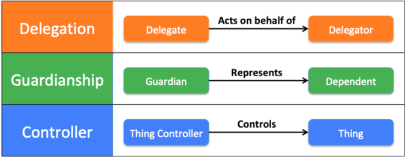
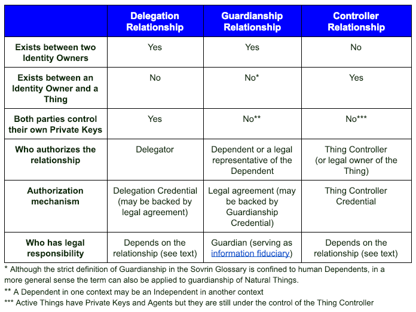

# 00xx: Indirect Identity Control
- Author: Daniel Hardman
- Start Date: 2019-05-10

## Status
- Status: [PROPOSED](/README.md#rfc-lifecycle)
- Status Date: 2019-06-04
- Status Note: Currently under study for implementation in various
pilots and POCs.

## Summary

This RFC compares and contrasts three forms of indirect identity control: __delegation__,
__guardianship__, and __controllership__. It then recommends mechanisms that allow identity
technology to model each with flexibility, precision, and safety. These recommendations
can be applied to any decentralized identity and credentialing ecosystem.

## Motivation

In most situations, we expect identity owners to directly control their own identities.
This is the ideal that gives "self-sovereign identity" its name. However, control is
not so simple in many situations:

* A corporation is governed by a Board of Directors, executives, and employees with
  multiple levels of delegated authority. The control relationships are dynamic
  and complex. (__delegation__)

* Parents typically manage the identities of their young children. Adult children may
  need to exercise the identity of a parent with dementia, or of a parent who
  recently passed away. (__guardianship__)

* A self-driving car may be capable of many independent actions, but behind such
  a smart device must be a human entity that takes legal responsibility. (__controllership__)

We need to understand how such situations color the interactions we have
in an identity ecosystem.

## Tutorial

[Appendix C of the Sovrin Glossary V2](
 https://docs.google.com/document/d/1gfIz5TT0cNp2kxGMLFXr19x1uoZsruUe_0glHst2fZ8/edit?pli=1#heading=h.uiq9py7xnmxd)
defines three forms of indirect identity control
relationship--delegation, guardianship, controllership--matching the three
bulleted examples above. Reviewing that document is highly recommended. It is the
product of careful collaboration by experts in many fields, includes useful
examples, and is clear and thorough.

Here, we will simply reproduce two diagrams as a summary:

>Note: The type of delegation described in Appendix C, and the type we focus on
in this doc, is one that crosses identity boundaries. There is another type
that happens _within_ an identity, as Alice delegates work to her various
agents. For the time being, ignore this __intra-identity delegation__; it is
explored more carefully near the end of the [Delegation Details](
delegation-details.md#infra-identity-delegation) doc.

### Commonalities

All of these forms of identity control share the issue of indirectness. All of them
introduce risks beyond the ones that dominate in direct identity management. All
of them complicate information flows and behavior. And they are inter-related;
guardians and controllers often need to delegate, delegates may become controllers,
and so forth.

The _solutions_ for each ought to have much in common, too--and that is the case. These
forms of indirect identity control use similarly structured credentials in similar
ways, in the context of similarly structured trust frameworks.
Understanding and implementing support for one of them should give developers and
organizations a massive headstart in implementing the others.

Before we provide details about solutions, however, let's explore what's common
and unique about each of the three forms of indirect identity control.

### Compare and Contrast

#### Delegation

Delegation can be either __transparent__ or __opaque__, depending on whether it's
obvious to an external party that a delegate is involved. A lawyer that files a
court motion in their own name, but on behalf of a client, is a transparent delegate.
A nurse who transcribes a doctor's oral instructions may be performing record-keeping
as an opaque delegate, if the nurse is unnamed in the record.

Transparent delegation is safer and provides a better audit trail than opaque delegation.
It is closer to the ethos of self-sovereign identity. However, opaque delegation is
a fact of life; sometimes a CEO wants her personal assistant to send a note or
meeting invitation in a way that impersonates rather than explicitly representing her.

Delegation needs __constraints__. These can take many forms, such as:

##### Constraints

1. Time (for what period(s) delegate has that status)
2. Place (in what physical or virtual locations delegate is approved)
3. Function (legal vs. medical vs. educational)
4. Circumstances (for particular event(s))
5. Biometrics (for delegator involvement)
6. Relationships (who delegate can interact with)
7. Attributes (data/credentials -- what delegate can know or prove about delegator)
8. Agents (what software/devices delegate can use)
9. Cooperation (act as delegate with joint approval of other delegates)
10. Oversight (audit trail, reporting)

Delegation needs to be __revokable__.

Delegates __should not mix identity data__ for themselves with data that may
belong to the delegator.

The rules of how delegation work need to be spelled out in a __trust framework__.

Sometimes, the indirect authority of a delegate should be __recursively extensible__
(allow sub-delegation). Other times, this may be inappropriate.

Use cases and other specifics of delegation are explored in greater depth in the
[Delegation Details](delegation-details.md) doc.

#### Guardianship

Guardianship has all the bolded properties of delegation: transparent or opaque styles,
constraints, revocation, the need to not mix identity data, the need for a
trust framework, and the potential for recursive extensibility. It also adds some
unique considerations.

Since guardianship does not always derive from dependent consent (that is,
the dependent is often unable to exercise sovereignty), the dependent in a guardianship
relationship is particularly vulnerable to abuse from _within_.

Because of this risk, guardianship is the most likely of the three forms of
indirect control to require an __audit trail__ and to involve legal formalities.
Its trust frameworks are typically the most nuanced and complex.

Guardianship is also the form of indirect identity control with the most complications
related to __privacy__.

Guardianship must have a __basis__ -- a justification that explains why the guardian
has that status. Not all bases are equally strong; a child lacking an obvious parent
may receive a temporary guardian, but this guardian's status could change if a parent
is found. Having a formal basis allows conflicting guardianship claims to be adjudicated.

Either the guardian _role_ or specific guardianship _duties_ may be delegated. An
example of the former is when a parent leaves on a long, dangerous trip, and appoints
a grandparent to be guardian in their absence. An example of the latter is when a
parent asks a grandparent to drive a child to the school to sign up for the soccer
team. When the guardian _role_ is delegated, the result is a new guardian. When
only guardianship _duties_ are delegated, this is simple delegation and ceases to
be guardianship.

Use cases and other specifics of guardianship are explored in greater depth in the
[Guardianship Details](guardianship-details.md) doc.

#### Controllership

Controllership shares nearly all bolded features with delegation. It is usually
transparent because things are usually known not to be identity owners in their
interactions, and things are assumed not to control themselves.

Like guardianship, controllership has a basis. Usually, it is rooted in property
ownership, but occasionally it might derive from court appointment. Also like
guardianship, either the _role_ or specific _duties_ of controllership may be
delegated. When controllership involves animals instead of machines, it may
have risks of abuse and complex protections and trust frameworks.

Unlike guardianship, controlled things usually require minimal privacy. However,
things that constantly identify their controller(s) in a correlatable way may undermine
the privacy of controllers in unexpected ways.

Use cases and other specifics of controllership are explored in greater depth in the
[Controllership Details](controllership-details.md) doc.

### Solution

We recommend that all three forms of indirect identity control be modeled with some
common ingredients:

#### Ingredients

* A __proxy trust framework__ that specifies the rules and conventions in force
 for a particular class of indirect identity control use cases.
* A __proxy credential__ that binds a controlled entity to its proxy and
 clarifies the nature and limits of the control for that specific relationship.
* A __proxy challenge__ that evaluates the proxy credential in a particular
 context, proving or disproving the legitimacy of indirect control and creating
 opportunities for auditing and enforcement.

Here, "proxy" is used as a generic cover term for all three forms of indirect
identity control. Each ingredient has a variant for each form (e.g., __delegation
credential__, __guardianship credential__, __controllership credential__), and
they have minor differences. However, they work so similarly that they'll be
described generically, with differences noted where necessary.

##### Proxy Trust Framework

A proxy trust framework is a published, versioned document (or collection
of documents) that's accessible by URI. Writing one doesn't have to be a
massive undertaking; see the [sample guardianship trust framework](
guardianship-sample/trust-framework.md) for a simple example).

It should answer at least the following questions:

1. What is the trust framework's __formal name__, __version__, and __URI__?
(The name cannot include a `/` character due to how it's paired with
version in credential `type` fields (see [Proxy Credential](#proxy-credential), below).
The version must follow [semver](https://semver.org) rules.)
1. In what __geos__ and __legal jurisdictions__ is it valid?
1. On what __bases__ are proxies appointed? (For guardianship, these might
include values like `kinship` and `court_order`. Each basis needs to be formally
defined, named, and published at a URI, because proxy credentials will reference
them. This question is mostly irrelevant to delegation, where the basis is
always an action of the delegator.)
1. What are the __required and recommended behaviors of a proxy (holder), issuer, and
verifier__? How will this be enforced?
1. What __permissions__ vis-a-vis the proxied identity govern proxy actions?
(For a delegate, these might include values like `sign`, `pay`, or `arrange_travel`.
For a guardian, these might include values like `financial`, `medical`, `do_not_resuscitate`,
`foreign_travel`, or `new_relationships`. Like _bases_, permissions need to be
formally defined and referencable by URI.)
1. What are possible __constraints__ on a proxy? (Constraints are bound to a
particular proxies, whereas a permission model is bound to the identity that
the proxy is controlling. Some constraints might include `geo_radius`,
`jurisdiction`, `biometric_consent_freshness`, and so forth. These values also
need to be formally defined and referencable by URI.)
1. What __auditing mechanisms__ are required, recommended, or allowed?
1. What __appeal mechanisms__ are required or supported?
1. What __proxy challenge procedures__ are best practice?
1. What __freshness rules__ are used for revocation testing and offline mode?

##### Proxy Credential

A proxy credential conforms to the [Verifiable Credential Data Model 1.0](
https://w3c.github.io/vc-data-model/). It can use any style of proof or data
format (JSON-LD, JWT, Sovrin ZKP, etc). It is recognizable as a proxy
credential by the following characteristics:

1. Its `@context` field, besides including the "https://www.w3.org/2018/credentials/v1"
 required of all VCs, also includes a reference to this spec:
 "https://github.com/hyperledger/aries-rfcs/concepts/0080-indirect-identity-control".

1. Its `type` field contains, in addition to "VerifiableCredential", a string in the
  format:

  

  ...where `form` is one of the letters D (for Delegation), G (for Guardianship), or C
  (for controllership), `trust framework` is the name that a Proxy Trust
  Framework formally declares for itself, `tfver` is its version, and `variant`
  is a specific schema named in the trust framework. A regex that matches this
  pattern is: `Proxy[.]([DGC])/([^/]+)/(\d+[^/]*)/(.+)`, and an example of a
  matching string is: `Proxy.G/UNICEF Vulnerable Populations Trust Framework/1.0/ChildGuardian`.

1. The metadata fields for the credential include `trustFrameworkURI" (the value of which is
  a URI linking to the relevant trust framework), `auditURI` (the value of which is a URI linking
  to a third-party auditing service, and which may be constrained or empty as specified in the
  trust framework), and `appealURI` (the value of which is a URI linking to an arbitration or
  adjudication authority for the credential, and which may be constrained or empty as specified
  in the trust framework).

1. The `credentialSubject` section of the credential describes a subject called `holder` and
  a subject called `proxied`. The holder is the delegate, guardian, or controller; the proxied
  is the delegator, dependent, or controlled thing.

1. `credentialSubject.holder.type` must be a URI pointing to a schema for `credentialSubject.holder` as
  defined in the trust framework. The schema must include the following fields:

    * `role`: A string naming the role that the holder plays in the permissioning scheme of
    the dependent. These roles must be formally defined in the trust framework. For example, a
    guardian credential might identify the holder (guardian) as playing the `next_of_kin` role,
    and this `next_of_kin` role might be granted a subset of all permissions that are possible
    for the dependent's identity. A controllership credential for a drone might identify the holder
    (controller) as playing the `pilot` role, which has different permissions from the
    `maintenance_crew` role.

    * `basisURI`: Required for guardianship credentials, optional for the other types. This
    links to a formal definition in the trust framework of a justification for holding
    identity control status. For guardians, the basisURI might point to a definition of the
    `blood_relative` or `tribal_member` basis, for example. For controllers, the basisURI
    might point to a definition of `legal_appointment` or `property_owner`.

  The schema may also include zero or more `constraint.*` fields. These fields would be used
  to limit the time, place, or circumstances in which the proxy may operate.

1. `credentialSubject.proxied.type` must be a URI pointing to a schema for `credentialSubject.proxied` as
  defined in the trust framework. The schema must include a `permissions` field. This field
  contains an array of __grants__, each of which is a JSON object in the form:

  

  ...where `recipient` is one of the following:

    * A named role such as `pilot` (going back to the controllership-of-a-drone example above)
      or `next_of_kin` (going back to the guardianship example above).

    * A JSON "n-of" object in the form:

      ![{"n": 3, "of": [recipients]}](n-of.png)

      ...where recipients allow recursion, and `n` is a positive
      integer <= the size of the recipients array. If n == 1, then this is effectively a
      boolean OR; any member of the recipients group can independently take the action.
      If n == length of recipients array, then this is effectively a boolean AND; all
      members of the recipients group must agree. If n is some other value, then a subset
      of the specified size must agree.

  ...and `actions` is an array of actions defined in the trust framework. This could include
  actions like piloting a drone, changing a child's legal name, etc.

  An example of the `credentialSubject.proxied.permissions` field might be:

  

  This says: Let a guardian who has the role of parent perform the "medical_care" and "school"
  actions for the dependent. Let a sibling perform the "school" action. Let either (parent+grandparent)
  or (3*grandparent) do all actions.

1. The credential MAY or MUST contain additional fields under `credentialSubject.holder` that
  describe the holder (e.g., the holder's name, DID, biometric, etc.). If the credential is
  based on ZKP/link secret technologies, then these may be unnecessary, because the holder
  can bind their proxy credential to other credentials that prove who they are. If not, then
  the credential MUST contain such fields.

1. The credential MUST contain additional fields under `credentialSubject.proxied` that
  describe the proxied identity (e.g., a dependent's name or biometric; a pet's RFID tag; a
  drone's serial number).

##### Proxy Challenge

A proxy challenge is an interaction in which the proxy must justify the control they are exerting
over the proxied identity. The heart of the challenge is a request for a verifiable presentation
based on a proxy credential, followed by an evaluation of the evidence. This evaluation includes
traditional credential verification, but also a comparison of a proxy's role (`credentialSubject.holder.role`)
to permissions (`credentialSubject.proxied.permissions`), and a comparison of circumstances
to constraints (`credentialSubject.holder.constraints.*`). It may also involve the creation of
an audit trail, depending ont he value of the `auditURI` field.

During the verifiable presentation, the holder MUST disclose all of the following fields:

* `@context`
* `type`
* `issuanceDate` (if present in schema)
* `expirationDate` (if present in schema)
* `credentialStatus` (if present in schema)
* `issuer`
* `trustFramework`
* `auditURI`
* `appealURI`
* `credentialSubject.holder.type`
* `credentialSubject.holder.role`
* `credentialSubject.holder.basisURI`
* `credentialSubject.holder.constraints.*`
* `credentialSubject.proxied.type`
* `credentialSubject.proxied.permissions`

In addition, the holder MUST prove that the proxy is the intended holder of the
credential, to whatever standard is required by the trust framework. This can be
done by disclosing additional fields under `credentialSubject.holder`, or by proving
things about the holder in zero knowledge, if the credential supports ZKPs. In the
latter case, proofs about the holder could also come from other credentials in the
holder's possession, linked to the proxy credential through the link secret.

The holder MUST also prove that the proxied identity is correct, to whatever standard
is required by the trust framework. This can be done by disclosing additional fields
under `credentialSubject.proxied`, or by proving things about the subject in zero
knowledge.

[TODO: discuss moments when proxy challenges may be vital; see
https://docs.google.com/presentation/d/1aq45aUHTOK_WhFEICboXQrp7dalpLm9-MGg77Nsn50s/edit#slide=id.g59fffee7a0_0_39 ]

[TODO: discuss offline mode, freshness, and revocation]

## Reference

A complete sample of a guardianship trust framework and credential schema
are attached for reference. Please also see the details about each form of
indirect identity control:

* Delegation Details
* Guardianship Details
* Controllership Details
