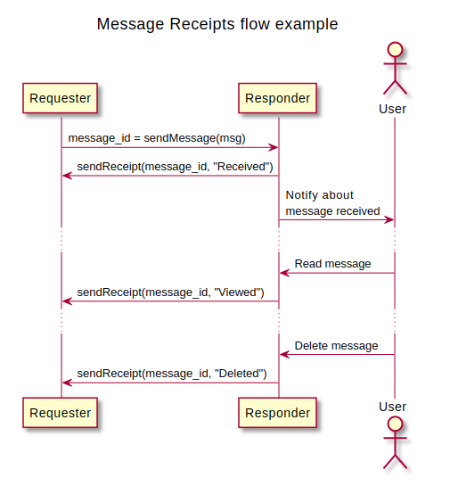
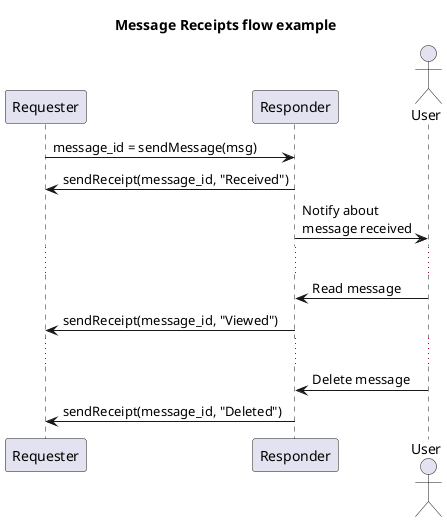

# Message Receipts protocol

- Authors: [Ariel Gentile](gentilester@gmail.com)
- Status: [PROPOSED](/README.md#proposed)
- Since: 2022-12-21
- Status Note: Initial version
- Start Date: 2022-12-21
- Tags: [feature](/tags.md#feature), [protocol](/tags.md#protocol)

## Summary

A protocol to allow a recipient to provide information about the processing of a message to the sender, letting it to keep track of its state.

## Application Scope

This protocol is intended to be used as a complement of any existing DIDComm protocol where it could be relevant to know whether the final user has seen or taken an specific action for a given message.

## Motivation

Although not a feature required or even desired by some users, all modern chat applications that can be seen nowadays include some sort of read receipts, useful for users to get feedback about the other party to have received or seen messages they have sent to them. Therefore, by defining a standard procedure for agents to set up their requirements on receipts of a particular, a set or all messages sent to a party, it is possible to build rich chat applications on top of DIDComm.

The scope of this protocol is not limited to particular types of messages, so it is meant to be used as a complement to any other protocol where receipts are applicable or meaningful.


## Protocol

**Name**: receipts

**Version**: 0.1

**Base URI**: `https://2060.io/didcomm/receipts/0.1/`

### Roles

**requester** - The agent requesting receipts for messages it sends

**responder** - The agent that receives messages and sends back receipts depending on user actions

### Flow

The protocol has two phases: setup and execution.

#### Setup phase

In order for an agent to receive receipts from another one, it must express their will. This can be simply achieved by sending the generic and explicit `Request Receipts` message, where it defines which kind of messages it wants to receive receipts for. 

It is enough to send this message only once through the lifecycle of a DIDComm connection, unless the _requester_ agent wants to change the paramaters.

Another way of expressing the desire of receiving receipts can be the usage of an specific decorator for each sent message that requires so. 

> **TODO**: Define decorator/DIDComm extension for receipts for individual messages

#### Execution phase

This phase is where agents usually spend most of the time. It consists on a single message where the _responder_ sends a single or multiple receipts, corresponding to messages previously sent by the _requester_.

There might be more than a receipt per message. Agent receiving them must order them by their timestamp.


<!--

-->

## Reference

This section explains the structure of the different messages defined for this protocol.

### Request Receipts

This message is used for a party to indicate to another one which message receipts they are insterested to receive, based on the message types.

```json
{
    "@id": "123456781",
    "@type": "<baseuri>/request-receipts",
    "requested_receipts": [
        {
            "message_type": "https://baseUri/protocol/1.0/message",
            "states": ["Received", "Viewed"]
        },
        {
            "message_type": "https://baseUri/protocol/1.0/*",
            "states": ["Received", "Viewed", "Deleted"]
        },        
        ...
    ]
}
```

`requested_receipts' field is an array containing all the relevant message types and supported states for each. 

- It's possible to use wildcards, i.e. for requesting receipts for every message of a particular protocol
- `states` is optional: if not set, recipient agent will send receipts for any state
- To entirely disable receipts, `requested_receipts` must be an empty array

If an agent wants to change its receipts preference, it must send this message again containing the new array. 


**Note**: 
> Not every type of message is applicable for receipts. For instance, `Message Receipts` message, as doing so would result in an infinite loop of receipts.

### Message Receipts

Through this message, an arbitrary number of Messsage Receipts can be transmitted. 

```json
{
    "@id": "123456781",
    "@type": "<baseuri>/message-receipts",
    "": [
        {
            "message_id": "originating message id",
            "state": "Viewed",
            "timestamp": "",
        },
        {
            "message_id": "originating message id",
            "state": "Received",
            "timestamp": "",
        },        
        ...
    ]
}
```


## Message states

Based on modern chat applications, the following states are defined as a minimal set for this protocol to be meaningful:

- Received: recipient agent has processed the message and made it available to see by the user
- Viewed: user on recipient end has seen the message
- Deleted: user on recipient end has explicitly selected to delete the message