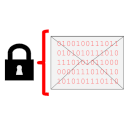
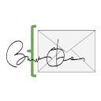

# 0044: DIDComm File and MIME Types
- Author: Daniel Hardman, Kyle Den Hartog
- Start Date: 2018-11-13

## Status
- Status: [PROPOSED](/README.md#rfc-lifecycle)
- Status Date: 2019-05-28
- Status Note: Socialized and accepted within Indy community, and used in
  several implementations of protocols that want to associate a MIME type
  with an HTTP payload. However, this version of the spec changes the
  type names of types slightly to genericize, so we're resetting the
  status. This RFC supersedes [Indy HIPE 0026](
  https://github.com/hyperledger/indy-hipe/blob/master/text/0026-agent-file-format/README.md).

content--messages--as well as the encrypted and signed
envelopes that contain them.

## Motivation
[motivation]: #motivation

Most work on DIDComm so far has assumed HTTP as a transport. However, we know
that DID communication is transport-agnostic. We should be able to
say the same thing no matter which channel we use.

An incredibly important channel or transport for messages is digital files. Files
can be attached to messages in email or chat, can be carried around on a thumb
drive, can be backed up, can be distributed via CDN, can be replicated on
distributed file systems like IPFS, can be inserted in an object store or
in content-addressable storage, can be viewed and modified in editors, and
support a million other uses.

We need to define how files can contain DIDComm messages, and what the
semantics of processing such files will be.

## Tutorial
[tutorial]: #tutorial

### DIDComm Encrypted Envelope (*.dee)

The raw bytes of an [encrypted envelope](../../features/0019-encryption-envelope/README.md)
may be persisted to a file without any modifications whatsoever. In such a case, the data
will be encrypted and packaged such that only specific receiver(s) can process it. However,
the file will contain a JOSE-style header that can be used by magic bytes algorithms to detect
its type reliably.

The file extension associated with this filetype is `dee`, giving a globbing pattern
 of `*.dee`; this should be be read as "STAR DOT D E E" or as "D E E" files.
If a format evolution takes place, a subsequent version could be
noted by appending a digit, as in `*.dee2` for second-generation `dee` files.

The name of this file format is "DIDComm Encrypted Envelope." We expect people to say,
"I am looking at a DIDComm Encrypted Envelope", or "This file is in DIDComm Encrypted Envelope format", or
"Does my editor have a DIDComm Encrypted Envelope plugin?"

Although the format of encrypted envelopes is derived from JSON and the JWT/JWE family
of specs, no useful processing of these files will take place by viewing them as
JSON, and viewing them as generic JWEs will greatly constrain which semantics are
applied. Therefore, the recommended MIME type for *.dee files is
`application/didcomm-enc-env`, with `application/jwe` as a fallback, and
`application/json` as an even less desirable fallback. (In this, we are making
a choice similar to the one that views `*.docx` files primarily as 
`application/msword` instead of `application/xml`.) If format evolution takes
place, the version could become a parameter as [described in RFC 1341](https://www.w3.org/Protocols/rfc1341/4_Content-Type.html):
`application/didcomm-enc-env;v=2`.

The default action for DIDComm Encrypted Envelopes (what happens when a user double-clicks one)
should be `Handle` (that is, process the message as if it had just arrived by some other transport),
if the software handling the message is an agent. In other types of software,
the default action might be to view the file. Other useful actions might include
`Send`, `Attach` (to email, chat, etc), `Open with agent`, and `Decrypt to *.dp`.

### DIDComm Signed Envelopes (*.dse)

When DIDComm messages are signed, the signing uses a JWS signing envelope. Often
signing is unnecessary, since authenticated encryption proves the sender of the
message to the recipient(s), but sometimes when non-repudiation is required, this
envelope is used. It is also required when the recipient of a message is unknown,
but tamper-evidence is still required, as in the case of a public invitation.

By convention, DIDComm Signed Envelopes contain plaintext; if encryption is used
in combination with signing, the DSE goes inside the DEE.

The file extension associated with this filetype is `dse`, giving a globbing pattern
 of `*.dse`; this should be be read as "STAR DOT D S E" or as "D S E" files.
Format evolution can add digits as with *.dee files.

The name of this file format is "DIDComm Signed Envelope." We expect people to say,
"I am looking at a DIDComm Signed Envelope", or "This file is in DIDComm Signed Envelope format", or
"Does my editor have a DIDComm Signed Envelope plugin?"

As with *.dee files, the best way to hande *.dse files is to map them to a custom
MIME type. The recommendation is
`application/didcomm-sig-env`, with `application/jws` as a fallback, and
`application/json` as an even less desirable fallback.

The default action for DIDComm Signed Envelopes (what happens when a user double-clicks one)
should be `Validate` (that is, process the signature to see if it is valid.

### DIDComm Messages (*.dm)

The plaintext representation of a DIDComm message--something like a credential
offer, a proof request, a connection invitation, or anything else worthy of a [DIDComm protocol](
../../concepts/0003-protocols/README.md)--is JSON. As such, it should be editable by anything
that expects JSON.

However, all such files have some additional conventions, over and above the simple
requirements of JSON. For example, key decorators have special meaning (
[`@id`, `@thread`](../../concepts/0008-message-id-and-threading/README.md),
[`@trace`](../../features/0034-message-tracing/README.md)
, etc). Nonces may be especially significant. The format of particular values
such as DID and DID+key references is important. Therefore, we refer to these messages
generically as JSON, but we also define a file
format for tools that are aware of the additional semantics.

The file extension associated with this filetype is `*.dm`, and should be read as
"STAR DOT D M" or "D M" files. If a format evolution takes place, a subsequent version could be
noted by appending a digit, as in `*.dm2` for second-generation `dm` files.

The name of this file format is "DIDComm Message." We expect people to say,
"I am looking at a DIDComm Message", or "This file is in DIDComm Message", or
"Does my editor have a DIDComm Message plugin?" For extra clarity, it is acceptable
to add the adjective "plaintext", as in "DIDComm Plaintext Message."

The MIME type of *.dm files is `application/json`--or, if further discrimination is needed,
`application/json;flavor=didcomm-msg`. If format evolution takes place, the version could
become a parameter as [described in RFC 1341](https://www.w3.org/Protocols/rfc1341/4_Content-Type.html):
`application/json;flavor=didcomm-msg;v=2`.

The default action for DIDComm Messages should be to
`View` or `Validate` them. Other interesting actions might be `Encrypt to *.dee`,
`Sign to *.dse`, and `Find definition of protocol`.

As a general rule, DIDComm messages that are being sent in production use cases of DID communication should be stored
in encrypted form (`*.dee`) at rest. There are cases where this might not be preferred, e.g., providing documentation of the
format of message or during a debugging scenario using
[message tracing](../../features/0034-message-tracing/README.md).
However, these are exceptional cases. Storing meaningful `*.dm` files
decrypted is not a security best practice, since it replaces all the privacy and
security guarantees provided by the DID communication mechanism with only
the ACLs and other security barriers that are offered by the container.

### Native Object representation

This is not a file format, but rather an in-memory form of a DIDComm Message
using whatever object hierarchy is natural for a programming language to map to and from
JSON. For example, in python, the natural Native Object format is a dict that contains properties
indexed by strings. This is the representation that python's `json` library expects when
converting to JSON, and the format it produces when converting from JSON. In Java, Native
Object format might be a bean. In C++, it might be a `std::map<std::string, variant>`...

There can be more than one Native Object representation for a given programming language.

Native Object forms are never rendered directly to files; rather, they are serialized to DIDComm Plaintext Format
and then persisted (likely after also encrypting to DIDComm Wire Format).

## Reference

The file extensions and MIME types described here are also accompanied by suggested graphics.
[Vector forms of these graphics are available as well](
https://docs.google.com/presentation/d/1QmKxuMz8KnqYbdGUEOaNqLtZSCZryQrwj9RRXMN4uAk/edit#slide=id.p).