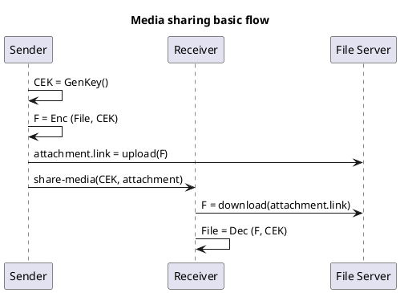
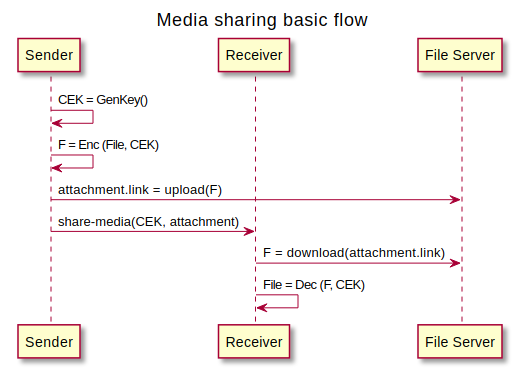
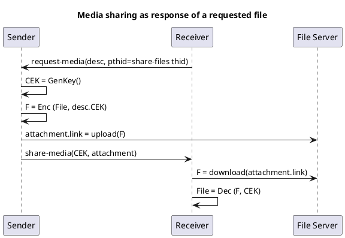
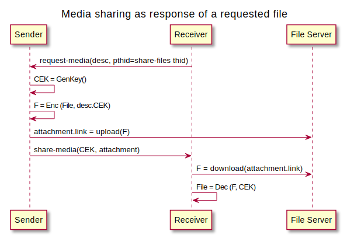
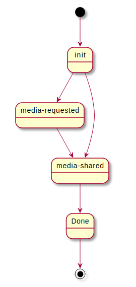
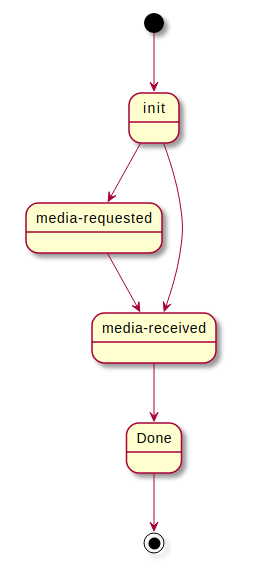

# XXXX: Media Sharing protocol

- Authors: [Ariel Gentile](gentilester@gmail.com)
- Status: [PROPOSED](/README.md#proposed)
- Since: 2022-12-21
- Status Note: Initial version
- Start Date: 2022-12-21
- Tags: [feature](/tags.md#feature), [protocol](/tags.md#protocol)


## Summary

A protocol to share media files (and any content in general) in a secure and efficient manner.

## Application Scope

This protocol is intended to be used by any DIDComm agent willing to share large data to a single or multiple connections.

## Motivation

DIDComm allows to establish secure, trusted connections and exchange arbitrary data between parties involved in them. However, due to the fact that it is transport-agnostic and generic enough to be run in a wide range of agents, exchanging _inlined_ data through this channel only might not be as efficient (in terms of bandwith and CPU power) as doing so by using other mechanisms, especially when a large amount of data is being shared and more than a single pair of devices are involved in such exchange (e.g. multi-party connections or peers who are using more than a device).

For such cases, this protocol is defined to share data _by reference_, relying on third-party services to do the actual upload/storage/download. Depending on the trust on such third-party services, files can be previously encrypted or simply left as plain data.


## Protocol

**Name**: media-sharing

**Version**: 1.0

**Base URI**: `https://2060.io/didcomm/media-sharing/0.1/`

### Roles

**sender** - The agent willing to share media files

**receiver** - The agent that will receive the shared media 

### Flow

In an initial file sharing, the _sender_ will typically generate content encryption keys (CEK) for each file they want to share. This step could be omitted in case of media items that are encoded inline in DIDComm channel.

Then, it will upload encrypted contents in such a way that they are accesible in an URI reachable by the recipient. 

With this information, it will generate the **share-media** message that will be received by the _receiver_, who will download and decrypt all shared files the message might contain. If requested, it will answer with an ack confirming the correct reception of the message (however, this does not mean it could properly interpret or download each shared file). `problem-report` could be used to inform the sender about any issue downloading or decrypting the contents (TODO: define error codes).

<!--

-->


There is another possible flow, where the protocol is started by the request of a previously shared file that appears to not be available by the recipient (e.g. they deleted the file locally and the sender has already deleted it as well from the shared file server). 

In such case, the protocol starts with a **request-media** message which should use the original protocol thid as pthid.

<!--

-->



## States

Depending on the role, the following states are possible:

#### Sender states

- media-requested
- media-shared
- done

<!--
```plantuml
state "init" as Init
state "media-requested" as FileRequested
state "media-shared" as FileShared
[*] -> Init
Init -> FileRequested
FileRequested -> FileShared
Init -> FileShared
FileShared -> Done
Done -> [*]
```
-->


#### Receiver states

- media-requested
- media-shared
- done

<!--
```plantuml
state "init" as Init
state "media-requested" as FileRequested
state "media-received" as FileReceived
[*] -> Init
Init -> FileRequested
FileRequested -> FileReceived
Init -> FileReceived
FileReceived -> Done
Done -> [*]
```
-->


## Reference

This protocol currently defines a few specific messages, but uses DIDComm core mechanisms such as threading and ack (and may use other extensions) to enrich the flow.

### Share Media

Through this message, a sender can share a number of media items, that are sent as regular [appended attachments](https://github.com/hyperledger/aries-rfcs/blob/7759addb1506d107fddec692403bbc9e55fe491f/concepts/0017-attachments/README.md#appending).

```json
{
    "@id": "123456781",
    "@type": "<baseuri>/share-media",
    "description": "free text describing the files that are about to be shared",
    "sent_time": "timestamp in ISO 8601 UTC",
    "items": [
        {
            "@id": "attachment id",
            "ciphering": {
                "algorithm": "AES-256-GCM",
                "parameters" : {
                    "iv": "2f3849399c60cb04b923bd33265b81c7",
                    "tag": "e84a14b9542320a0b1473141c989c48f",
                    "key": "233f8ce4ac6aa125927ccd98af5750d08c9c61d98a3f5d43cbf096b4caaebe80"
                }
            },
            "mime-type": "image/png",
            "filename": "image1.png",
            "description": "This particular image description",
            "data": {
            "links": [ "https://fileserver.com/ref1-uuid" ]
            },
            "metadata": { /* any relevant metadata (e.g. preview, duration */}
        ... 
        }
    ]
}
```

### Request Media

This message allows a recipient to ask for a previously shared media. This is mainly intended to be used in cases where the shared data is not available anymore in the third-party service used to store it originally.

```json
{
    "@id": "123456781",
    "@type": "<baseuri>/request-media",
    "description": "free text describing the media items that are requested",
    "requested-items": [ "id-1" ]
}
```

