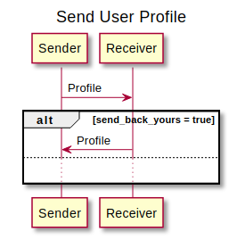
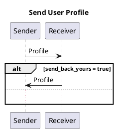

# XXXX: User Profile protocol

- Authors: [Ariel Gentile](gentilester@gmail.com)
- Status: [PROPOSED](/README.md#proposed)
- Since: 2022-12-21
- Status Note: Initial version
- Start Date: 2022-12-21
- Tags: [feature](/tags.md#feature), [protocol](/tags.md#protocol)


## Summary

A simple protocol for exchanging user profile information between parties.

## Application Scope

Data exposed and exchanged within this protocol can be seen as a complement to the basic and untrusted connection information exchanged in Out-of-Band Invitation messages.

## Motivation

Modern communication applications normally need some user-friendly information about the other party. For that purpose it's needed to provide a common mechanism to sharing and retrieving user profile information, which might change over time, in more secure and efficient way than the usual Connection Invitation.

## Protocol

**Name**: user-profile

**Version**: 0.1

**Base URI**: `https://2060.io/didcomm/user-profile/0.1/`

### Roles

**sender** - The agent that is sending their user profile

**receiver** - The agent that is receiving the user profile from another one

### Flow

Exchanges within this protocol involve a single message when an agent wants to share their profile (or any update to it) without asking for other party profile; two messages might be exchanged in case of `Get Profile` or `Profile` with `send_back_yours` enabled.


<!--

-->

## Reference

This section explains the structure of the different messages defined for this protocol.

### Profile

This message is used to send user profile to another party. Any field not included means that there is no change on that field so the recipient must keep the previous value for this connection.

```json
{
    "@id": "123456781",
    "@type": "<baseuri>/profile",
    "profile": {
        "displayName": "John Doe",
        "displayPicture": "data:image/png;base64,iVBORw0KGgoAAAANSUhEUgAAAKsAAADV...",
        "description": "This is my bio"
    }, 
    "send_back_yours": true
    ]
}
```

All currently defined fields are encoded as strings and can be referencing an attachment (i.e. displayPicture can point to an attachment with links or an embedded base64 picture).

When `send_back_yours` parameter is defined and set to true, the recipient is expected to send another Profile message containing their profile. Such message should include this message ID as pthid. Agents must not include this parameter when the message is created as a result of another one.

### Get Profile

This message is used to request a profile . Recipient is expected to send their profile at its current state.

```json
{
    "@id": "123456781",
    "@type": "<baseuri>/get-profile",
    "query": [ "displayName", "displayPicture", "description" ]
}
```

`query` parameter is optional and defines which fields the requester is interested in. If no specified, responder must send their full profile.